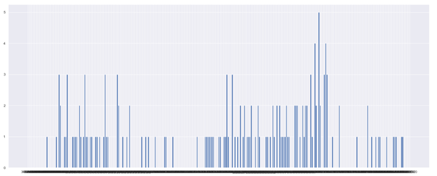
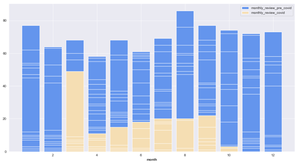
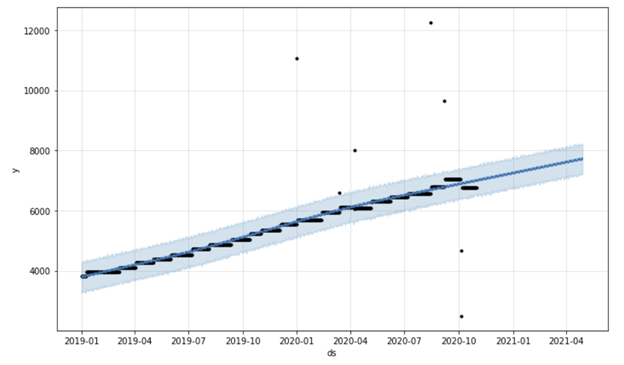

# Airbnb-COVID-19-Data-Analaysis
## Table of Contents
**Introduction**  
1.	 Data   
2.	 Datasets Overview   
3.	 EDA
4.	 Assumptions
5.	Covid in San Francisco

**Market Supply**

**Market Demand**

**Revenue Analysis**

**Exit Listings**

**Text Mining**
1.	Sentiment Analysis
2.	Topic Modeling 

**Conclusion**

**Appendix**

---
## Introduction
For this project, we are looking into the Covid-19 impact on the San Francisco Air BnB market. San Francisco was one of the first cities in the US deeply affected by Covid-19, with its first case on February 3 and an official lockdown order going into place on March 16. The lockdown remained in effect until June 1. This caused many small businesses, particularly in the travel and tourism industry, to have to shut down for extended periods of time. Because of this, we wanted to analyze how the pandemic affected the Air BnB market along with the projections for the future and which types of listings are most likely to survive through the pandemic without closing their doors.
Through this, we are looking to answer the following questions:

●	How does the COVID 19 pandemic affect the selected city’s Airbnb market?

●	What factors have affected Airbnb hosts’ market exit decisions?

●	What types of properties have been affected the most?

As a note, because of the amount of code generated along with the current length of the report, exact codes for replication are included within the associated code files folder. All files are named respective to the section they cover in the report.

**Data**

AirBnB data was sourced from: http://insideairbnb.com/get-the-data.html
For this project, datasets were used from the Calendar, Listings, and Reviews gz files scraped in October 2020. 
Additional reviews and listings files were scraped from December 2020 as more information became available.

Calendar Dataset

The calendar dataset has 7 columns: listing_ID, date, available, price, adjested_price, minimum_nights, and maximum_nights. No columns are unique identifiers. Available is a binary category indicating whether a listing is available “t” or already booked “f”. No columns were removed from the calendar datasets before pre-processing. 

The calendar data files display availability information per listing per day from the day of the scrape through one year into the future. Because of this, historical booking data was unavailable. As a proxy, Calendar gz files were taken every month from December of 2018 through October of 2020. Availability information was preserved solely from the date of scrape to the date before the following scrape, preventing duplicate data from being included inside the data frame as shown below:

However, it is important to note that because this booking information is forward-facing, information such as cancellations and last-minute bookings are unavailable. Thus, booking information is calculated from bookings taken between 0-30 days in advance of each scrape.

A time series of January 2019 through October 2020 was selected in order to provide a solid comparison of the 2020 data to a typical trend. The addition of the whole of 2019 also provided key information to input into our time-series analysis for prediction 180 days in advance.

Listings Dataset

The Listings dataset has 73 columns which describe about the attributes of the individual listings. Each listing is identified by its unique ‘ID’. The attributes of the listings can be known by the columns ‘description’, ‘listing_url’, ‘picture_url’. The ‘latitude’ and ‘longitude’ columns tell us about the location of the listing. The price for each listing is mentioned under the ‘price’ column. All the amenities provided by the listing are aggregated and mentioned in a separated column. 
Each listing has ‘host_id’ which gives the ID of the host. There are several columns that describe the characteristics of the host such as name, their location,their verification status, when they joined Airbnb, what their response and acceptance rate is, how many other listings are registered by the same host and binary column indicating if the host is superhost or not. 

There are few columns that describe the neighbourhood of the property and few others that describe the room type, accommodations, number of beds, bedrooms and bathrooms. Availability columns indicate the days the listing is available for the next 30, 60, 90 and 365 days. Columns ‘minimum_nights’ and ‘maximum_nights’ tell us about the number of minimum and maximum nights the listing can be booked.

The reviews columns give information about the dates of the first and last review, total numbers of reviews from the begin date and reviews in the last month. Each listing has review scores based on rating, accuracy, cleanliness, checkin, communication, location and value. These ratings are scored in the range of 2-10. 

Column ‘calculated_host_listings_count’ gives the value which is the actual number of host listings. This column is further split based on the type of listing such as entire homes, private rooms and shared rooms. 

Reviews Dataset

The reviews file has 6 columns. The columns would be listing_id, id,date, reviewer_id, reviewer_name, comments. The listing_id column is the id of the which is unique to every listing.The id column is the id which uniquely identifies each record of the dataset. The date column has the date as to when the customer has given a review to the listing he has stayed.The reviewer_id and reviewer_name are the attributes of each reviewer where in the former attribute gives an id which uniquely identifies each customer and the later gives the name of the reviewer. The column comments is the review given by each customer for their stay at a place. For text mining, our focus is more on the comments column for performing sentiment analysis and topic modeling.

Covid Dataset

Covid data is taken from DataSF. 
File used: COVID-19_Cases_Summarized_by_Date__Transmission_and_Case_Disposition.csv  This file does include covid information until 10th Dec 2020. Original file has 5 columns “Specimen Collection Date, Case Disposition, Transmission Category, Case Count, Last Updated At”.  The column ‘Case Disposition’ has two values - Confirmed and death. Value ‘Confirmed’ represents confirmed covid case and value ‘death’  represents covid death.  

We have done some data preprocessing on the file above before reading

•	Filled missing dates with 0 records(very few at the start), filled those dates with 0 cases and deaths.

•	Based on the column ‘Case Disposition’, new columns are created 

   	Column with values ‘Confirmed’ are taken as New_cases for that date

   	Column with values ‘Death’ are taken as New_Deaths for that date

•	New columns ‘Cumulative_Cases’, ‘Cumulative_Deaths’ are created by accumulating the values of ‘New_Cases’ and ‘New_Deaths’ respectively

Final Covid dataset after preprocessing:
Upon preprocessing, new file has the following columns:
Date, New_Cases, Cumulative_cases, New_Deaths, Cumulative_Deaths

Final Datasets
Calender_Merged was created by merging the calendar dataset with the selected columns from the Listings dataset by Listing_ID. Because the listings file was not spliced by month, all of the merged columns from that table are stagnant by date. The only columns that change over time are from the calendar dataset.

Reviews_Merged was created by merging the reviews dataset with the selected columns from the Listings dataset by Listing_ID. 

**EDA and Initial Preprocessing**

Initial EDA was done on the listings file. This would us in deciding the significant features and the the ones that need to be dropped due to their redundancy to the final model.

There were few columns such as bedrooms, calendar_updated that had entirely missing values. We decided to drop all of them as they would be redundant to be included in the model

The correlation was done on the listings file and we could observe multicollinearity between a few features such as  maximum_nights and maximum_maximum_nights. We decided to drop such columns that were highly correlated as it would not be good for the model if included.

From the has_availability column, we can observe that there were only listings that were available and not booked.

From the above EDA, we can observe that there were more listings that included Entire home/apt,  Private rooms and a few number of hotel rooms. This would be useful in explaining the effects Covid has on airbnb further.

After careful analysis and EDA done on the listings file, we could come up with a few data preprocessing steps as follows:

●	Calender_updated, neighbour_group_cleansed, bathrooms were dropped due to containing all missing values

●	listing_url and host_url were dropped as we already have their respective ID columns 

●	scrape_id was dropped due to being a constant

●	last_scraped was dropped due to its insignificance to the model

●	calendar_last_scraped was dropped as it is same as the last_scraped column

●	maximum_maximum_nights, maximum_nights_avg_ntm were dropped as we already have maximum nights column

●	minimum_minimum_nights, minimum_maximum_nights, minimum_nights_avg_ntm were dropped as we already have minimum nights column and would be redundant to include

●	has_availability, availability_30, availability_60, availability_90, availability_365 were dropped as we already have availability by date

**Assumptions**

Because the calendar and listings datasets are forward-facing, a few assumptions needed to be made. These are as follows

●	Booked rooms are indicative of room stays

●	Reviews are indicative of room stays

●	Exited listings can be defined as a listing which has not had a review in the past three months

**Analysis - Covid in San Francisco**

New cases per day

Covid cases raisen to 200+ numbers per day since 1st December. Top 3 months with the highest number of cases recorded in a day are December(297), November(275), July(163). 

SF Covid cases per month

Joy plot above shows the distribution of covid cases per month in SF. July and November are the months with the highest number of cases. 

Overall, total number covid cases crossed 18000 by the first week of december.  Better month in terms of the number of covid cases is May with the lowest number of cases of 880. The graph shows that covid cases are on the rise in the months of July(3262), November(3633) and December(by 10th dec- 2305).

SF Covid Deaths per day

Month of October recorded 5 deaths in a day. 

Cumulative Covid Deaths - per month

Overall, total number covid deaths crossed 160 by the first week of December. Covid deaths are high in September(31) followed by April(26) and October(26). The better month in terms of covid deaths is June, with 4 people lost lives to covid.

Covid cases - Pairplot by month

On average, number cases per day are high in the months of July, November and December.
On average, the number of deaths are high in September(31) followed by October(26).

AirBnB Data Analysis

SF hosts joining Airbnb and listings getting their first review in each month.

As depicted in the graph, hosts joining airbnb have significantly dropped in the covid period. Which also indicates that new listings and that listings getting their first review is dropped as well. The last date any host joined Airbnb is on 2020-08-25.

Monthly reviews per listing

This graph shows the highest number of reviews any listing received in the respective months. As you can see, review data is divided into two sets - pre covid(till Feb2020) and covid(From Mar 2020) periods. This graph also shows that the highest number of reviews any listing received after covid is way below pre-covid period, which reiterates the negative impact of covid on the airbnb market. 

Time Series Forecasting

Time series forecasts were created by performing data aggregation by date to determine the daily number of listings along with the number booked. From here, the Facebook Prophet model was used to determine what can be expected moving forward for both the market demand and supply for the next 180 days.

---
## Market Supply

Market supply was determined as the total number of listings per month, regardless of whether the availability was denoted as true or false. The underlying assumption for this is that if a listing is taken off of the market, it will no longer be shown within the dataset.

The chart below shows the total number of listings by day, along with the projected number of listings by month for the next 180 days.

In this chart, the black lines are our actuals, the blue line is the yhat value, and the light blue shaded areas are our 85% confidence interval. Surprisingly, we do not see a drop in the number of listings by month in our dataset. Instead, we see a fairly consistent trend upwards in terms of the number of Air BnB supply numbers.

In order to determine if this trend was consistent across the board, the data was then subsetted by room type. 

From the above daily listings summaries and prophet model, it appears that Covid-19 has had almost no impact in the upward trend in total listings for the category “entire home/ apt.” This is likely due to the hosts having little to no contact with the listing space, having much lower risk than the other categories. While the category “private room” also sees an increase in listings through the entire timespan of our data, there is a distinct slowing of the listing increase after about February 2020. Shared room listings also seem, surprisingly, to be on the rise post-covid. Hotel rooms appear to have taken a dive from January through May but has been on the rise since.
In addition, models were generated by subsetting the data by neighborhood. Below is a graph showing the overall number of listings per neighborhood as of October 2020. 

